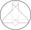

<a id="org584a4eb"></a>
# Tomosipo

[](https://anaconda.org/aahendriksen/tomosipo)
[](https://anaconda.org/aahendriksen/tomosipo)
[](https://www.gnu.org/licenses/gpl-3.0)

Tomosipo is a pythonic wrapper for the ASTRA-toolbox of high-performance GPU
primitives for 3D tomography.

The aim of this library is as to:

-   Expose a user-friendly API for high-performance 3D tomography, while
    allowing strict control over resource usage
-   Enable easy manipulation of 3D geometries
-   Provide easy integration with
    -   Deep learning toolkits, such as [PyTorch](https://pytorch.org)
    -   [The operator discretization library (ODL)](https://github.com/odlgroup/odl) for optimization in
        inverse problems
    -   [PyQtGraph](http://pyqtgraph.org/) for interactive visualization of geometries and data

The documentation can be found [here](https://aahendriksen.gitlab.io/tomosipo/index.html).

2.  [Installation](#org85d2a99)
3.  [Usage](#orgb723de1)
    1.  [Create and visualize geometries](#org887ab1a)
    2.  [Express algorithms succinctly](#orgc1f2b6b)
    3.  [More examples](#org4c299a8)
4.  [Authors and contributors](#org2e2678c)


<a id="org85d2a99"></a>
# Installation

A minimal installation requires:

-   python >= 3.6
-   ASTRA-toolbox >= 2.0
-   CUDA

The requirements can be installed using the anaconda package manager. The
following snippet creates a new conda environment named `tomosipo` (replace
`X.X` by your CUDA version)

    conda create -n tomosipo cudatoolkit=<X.X> tomosipo -c defaults -c astra-toolbox -c aahendriksen

More information about installation is provided in the [documentation](https://aahendriksen.gitlab.io/tomosipo/intro/install.html).

<a id="orgb723de1"></a>
# Usage

Simple examples:

<a id="org887ab1a"></a>

## Create and visualize geometries

You can follow along on [Google
Colab](https://colab.research.google.com/github/ahendriksen/tomosipo/blob/master/notebooks/00_getting_started_google_colab.ipynb).

``` python
import astra
import numpy as np
import tomosipo as ts

# Create 'unit' cone geometry
pg = ts.cone(angles=20, size=np.sqrt(2), cone_angle=0.5)
print(pg)

# Create volume geometry of a unit cube on the origin
vg = ts.volume()
print(vg)

# Display an animation of the acquisition geometry
ts.svg(pg, vg)
```


<a id="orgc1f2b6b"></a>

## Express algorithms succinctly

In the following example, we implement the simultaneous iterative
reconstruction algorithm (SIRT) in a couple of lines. This examples
demonstrates the use of the forward and backward projection.

First, the SIRT algorithm is implemented using numpy arrays, which
reside in system RAM. Then, we move all data onto the GPU, and compute
the same algorithm using PyTorch. This is faster, because no transfers
between system RAM and GPU are necessary.

``` python
import astra
import numpy as np
import tomosipo as ts
from timeit import default_timer as timer

# Create 'unit' cone geometry, and a
pg = ts.cone(size=np.sqrt(2), cone_angle=1/2, angles=100, shape=(128, 192))
# Create volume geometry of a unit cube on the origin
vg = ts.volume(shape=128)
# Create projection operator
A = ts.operator(vg, pg)

# Create a phantom containing a small cube:
phantom = np.zeros(A.domain_shape)
phantom[20:50, 20:50, 20:50] = 1.0

# Prepare preconditioning matrices R and C
R = 1 / A(np.ones(A.domain_shape))
R = np.minimum(R, 1 / ts.epsilon)
C = 1 / A.T(np.ones(A.range_shape))
C = np.minimum(C, 1 / ts.epsilon)

# Reconstruct from sinogram y into x_rec in 100 iterations
y = A(phantom)
x_rec = np.zeros(A.domain_shape)
num_iters = 100

start = timer()
for i in range(num_iters):
    x_rec += C * A.T(R * (y - A(x_rec)))
print(f"SIRT finished in {timer() - start:0.2f} seconds")

# Perform the same computation on the GPU using PyTorch.
# First, import pytorch:
import torch

# Move all data to GPU:
dev = torch.device("cuda")
y = torch.from_numpy(y).to(dev)
R = torch.from_numpy(R).to(dev)
C = torch.from_numpy(C).to(dev)
x_rec = torch.zeros(A.domain_shape, device=dev)

# Perform algorithm
start = timer()
for i in range(num_iters):
    x_rec += C * A.T(R * (y - A(x_rec)))

# Convert reconstruction back to numpy array:
x_rec = x_rec.cpu().numpy()
print(f"SIRT finished in {timer() - start:0.2f} seconds using PyTorch")
```

    SIRT finished in 2.07 seconds
    SIRT finished in 0.94 seconds using PyTorch


<a id="org4c299a8"></a>

## More examples

Please checkout the `examples` and `notebooks` directory for more examples.


<a id="org2e2678c"></a>

# Authors and contributors

tomosipo is developed by the Computational Imaging group at CWI. Original author:

-   **Allard Hendriksen**

We thank the following authors for their contribution

-   **Johannes Leuschner** - ODL integration

See also the list of contributors who participated in this project.

