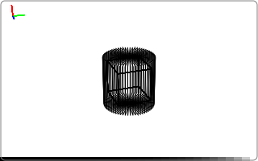

.. _intro_forward_projection:

Creating a tomographic projection
=================================

.. note::
   To keep the size of the documentation in version control manageable, we do
   not include images of the volume and the reconstruction. It is recommended to
   follow along in your favorite python environment so you can see what is going
   on.

In this walkthrough, we will create tomographic projections using tomosipo.
First, we import the necessary packages. By convention, `tomosipo` is imported
as `ts`:

.. testcode:: session

   import tomosipo as ts
   import numpy as np

Now we can create a volume and a circular parallel-beam projection geometry. The
volume is a three-dimensional unit cube and is composed of 32 voxels in each dimension.

The parallel-beam geometry has 32 angles that are equi-spaced over a half arc.
The detector has 48 pixels in each dimension and 1.5 units high and wide.

.. testcode:: session

   vg = ts.volume(shape=(32, 32, 32), size=(1, 1, 1))
   pg = ts.parallel(angles=32, shape=(48, 48), size=(1.5, 1.5))

If the size of argument is not specified, the default voxel size of a volume
geometry equals one and the size equals the shape.
See :meth:`tomosipo.volume` for more information. Similary, the
pixel size of the projection geometry equals one by default. Instead of
specifying the number of angles, the angles of the parallel-beam geometry can
also be specified as an array. For more information, see
:meth:`tomosipo.parallel`.

The geometries have a readable string representation, we can see what we have
created as follows:

.. doctest:: session

   >>> vg
   ts.volume(
       shape=(32, 32, 32),
       pos=(0.0, 0.0, 0.0),
       size=(1.0, 1.0, 1.0),
   )
   >>> pg
   ts.parallel(
       angles=32,
       shape=(48, 48),
       size=(1.5, 1.5),
   )

In addition, we can display the geometry as an SVG animation:

.. testcode:: session

   svg = ts.svg(vg, pg)
   svg.save("./doc/img/intro_forward_projection_geometries.svg")

As you can see, the detector moves through the volume. Although this is
physically impossible, this is not a problem because the projection operator
takes into account ray-volume intersections both behind and in front of the
detector.

A projection operator can be created as follows:

.. testcode:: session

   A = ts.operator(vg, pg)

The operator has two useful properties `domain_shape` and `range_shape` that can
be used to create volume and projection data:

.. doctest:: session

   >>> A.domain_shape, A.range_shape
   ((32, 32, 32), (48, 32, 48))
   >>> x = np.ones(A.domain_shape, dtype=np.float32)

As you can see, the projection data is stored as a stack of sinograms, following
the ASTRA-toolbox convention. The first dimension equals the height of the
detector, the second dimension equals the number of angles, and the third
dimension equals the width of the detector.

Now, we can create a projection by applying the operator to the data `x`:

.. doctest:: session
   :skipif: not cuda_available

   >>> y = A(x)
   >>> y.shape
   (48, 32, 48)

You can take a look at the projections using matplotlib.

.. testcode:: session
   :skipif: (not cuda_available) or (not matplotlib_available)

   import matplotlib.pyplot as plt
   plt.imshow(y[:, 0, :]) # first projection
   plt.imshow(y[:, 8, :]) # quarter rotation

Proceed to the :ref:`next tutorial <intro_simple_reconstruction>` to see a
reconstruction can be computed of the obtained projection data.
