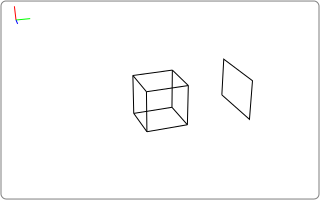
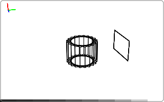
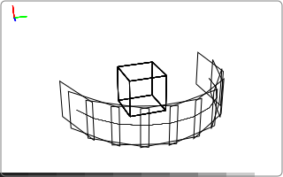

.. _intro_lab_frame:

Lab frame: rotating object instead of rotating detector
=======================================================

In the previous tutorials, the object remained static while the detector was
moving. This is the conventional way in which the ASTRA-toolbox models
tomography. In practice however, it is often the case that the object is mounted
on a rotation stage in front of a static detector. It is useful to model the
geometries like this in software as well, because it makes it easier to adjust
parameters like the center of rotation and the relative location of the
detector relative to the object.

In this tutorial, we will use geometric transforms to rotate the object.
Geometric transforms are described in the :ref:`Geometric transforms topic guide
<topics_geometric_transforms>`. In addition, this will be the first time we use
a vector geometry, which is a geometry that is less restricted in its movement
and can be arbitrarily oriented. Geometries and vector geometries are described
in the :ref:`Geometries topic guide <topics_geometries>`.

First, let's create a static volume and a static parallel-beam detector geometry:

.. testcode:: session

   import tomosipo as ts
   import numpy as np

   vg = ts.volume(pos=0, size=1)
   pg = ts.parallel_vec(
       shape=1,
       ray_dir=(0, 1, 0),
       det_pos=(0, 2, 0),
       det_v=(1.0, 0, 0),
       det_u=(0, 0, 1.5),
   )
   svg = ts.svg(vg, pg)
   svg.save("./doc/img/intro_lab_frame_0.svg")

.. note::

   The volume and detector consist of a single voxel and a single pixel, which
   is fine for the purpose of illustration. If you want to reconstruct real
   data, edit the `shape` parameter.

As you can see, we have created a detector that is slightly wider than it is
high, which is located at 2 units away from the volume along the `y` axis. Note
that the order of the axes is `Z, Y, X`, as described in
:ref:`topics_units_axes_indexing`.

We can create a rotation transform as follows:

.. testcode:: session

   angles = np.linspace(0, np.pi, 10, endpoint=False)
   R = ts.rotate(pos=(0, 0, 0), axis=(1, 0, 0), angles=angles)

This rotation transform is an object that can be multiplied with a geometry to
move it:

.. testcode:: session

   vg_rot = R * vg.to_vec()
   svg = ts.svg(vg_rot, pg)
   svg.save("./doc/img/intro_lab_frame_rot.svg")

We create the rotating volume geometry `vg_rot` by applying the rotation `R` to
`vg`. Before applying the rotation, we convert the volume geometry to a vector
volume geometry. This is because a volume geometry cannot represent all possible
positions and orientations. If you forget to convert to a vector geometry, the
code issues a warning and converts the volume geometry to a vector volume
geometry automatically. The resulting geometry is shown in the figure below.

The rotating volume geometry and the detector geometry can be used to define a
tomographic operator. Internally, the rotating volume is "unrotated" and the
projection geometry is moved accordingly so that the volume is fixed on the
origin and axis-aligned again. This is necessary to use the ASTRA-toolbox's fast
GPU kernels.

.. doctest:: session

   >>> A = ts.operator(vg_rot, pg)
   >>> A.domain_shape
   (1, 1, 1)
   >>> A.range_shape
   (1, 10, 1)

As you can see, the `domain_range` is consistent with a static single voxel
volume, and the `range_shape` is consistent with a 10-angle single pixel
projection geometry.

You can plot these geometries as follows:

.. testcode:: session

   svg = ts.svg(A.astra_compat_vg, A.astra_compat_pg)
   svg.save("./doc/img/intro_lab_frame_astra_compat.svg")

Using these tools, you can easily define a tomographic operator where you can adjust the:
* pixel size,
* detector position,
* center of rotation,
* rotation angles, and
* voxel size.

The following snippet can serve as a template:

.. testcode::

   import tomosipo as ts
   import numpy as np

   # First define projection geometry
   pixel_size = 1.0
   detector_shape = (10, 10)
   detector_position = (0, 2, 0)

   pg = ts.parallel_vec(
       shape=detector_shape,
       ray_dir=(0, 1, 0),
       det_pos=detector_position,
       det_v=(pixel_size, 0, 0),
       det_u=(0, 0, pixel_size),
   )

   # Then define volume geometry
   volume_shape = np.array([1, 1, 1])
   voxel_size = np.array([1.0, 1.0, 1.0])
   num_angles = 10
   angles = np.linspace(0, np.pi, num_angles, endpoint=False)
   rot_axis_pos = (0, 0.1, 0.2)

   vg0 = ts.volume(
       shape=volume_shape,
       pos=(0, 0, 0),
       size=volume_shape * voxel_size,
   )
   R = ts.rotate(pos=rot_axis_pos, axis=(1, 0, 0), angles=angles)
   vg = R * vg0.to_vec()

   A = ts.operator(vg, pg)

For more templates of common geometries, see :ref:`howto_geometry_templates`.
