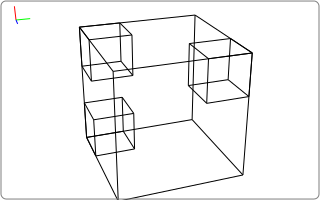
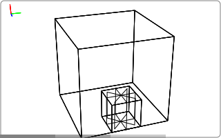
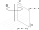
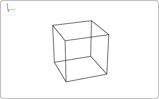
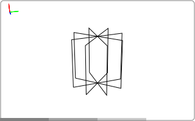
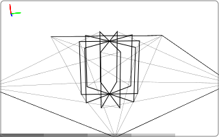

.. _topics_geometries:

==========
Geometries
==========

.. _topics_units_axes_indexing:

Units, axes and indexing
========================

Tomosipo follows NumPy's indexing convention. In the image below, we
display the coordinate axes and indexing into a volume cube.
The Z-axis points upward.

.. image:: ../img/volume_geometry.svg
   :width: 400
   :alt: Volume geometry indexing and axes

As you can see, the first coordinate indexes in the `z` direction, the second
coordinate in the `y` direction, and the third coordinate in the `x` direction.
By default, each voxel has a "physical size" of `1` unit. The voxel's height,
width, and depth can be customized arbitrarily, however.

We can recreate the above figure and check the documented behavior using
tomosipo as follows:

.. doctest::

   >>> import tomosipo as ts
   >>> vg = ts.volume(shape=3)
   >>> svg = ts.svg(vg, vg[0, 0, 0], vg[2, 0, 0], vg[2, 2, 2])
   >>> svg.save("./doc/img/topics_geometries_indexing.svg")
   >>> vg[0, 0, 0]
   ts.volume(
       shape=(1, 1, 1),
       pos=(-1.0, -1.0, -1.0),
       size=(1.0, 1.0, 1.0),
   )
   >>> vg[2, 0, 0]
   ts.volume(
       shape=(1, 1, 1),
       pos=(1.0, -1.0, -1.0),
       size=(1.0, 1.0, 1.0),
   )
   >>> vg[2, 2, 2]
   ts.volume(
       shape=(1, 1, 1),
       pos=(1.0, 1.0, 1.0),
       size=(1.0, 1.0, 1.0),
   )

We can also test that the index in the data corresponds to the index in the
volume geometry by forward projecting on a very small detector:

.. testcode::
   :skipif: not cuda_available

   import numpy as np
   import tomosipo as ts

   # Create a small detector rotating through single voxel:
   vg = ts.volume(shape=3)
   pg = ts.parallel(angles=4, shape=1).to_vec()
   T = ts.translate(vg[0, 1, 2].pos)

   # Save geometry animation:
   ts.svg(vg, vg[0, 1, 2], T * pg).save("./doc/img/topics_geometries_check.svg")

   # Project on detector:
   A = ts.operator(vg, T * pg)
   x = np.zeros(vg.shape, dtype=np.float32)
   x[0, 1, 2] = 1.0
   print(A(x))

.. testoutput::
   :skipif: not cuda_available

   [[[1.       ]
     [1.4142135]
     [1.       ]
     [1.4142135]]]

We display an example for a parallel geometry with its associated
sinogram indexing below. The detector coordinate frame is defined by
two vectors

-   **u:** Usually points sideways and to the "right" from the perspective
    of the source. The length of u defines the width of a detector
    pixel.
-   **v:** Usually points upwards. The length of v defines the height of a
    detector pixel.

Here, we see that the order of the physical dimensions does not match the order
of the data indices. For performance reasons, projection data is stored as a
sinogram stack indexed in `(v, angle, u)` order. The projection geometry
coordinates are `(angles, v, u)`, however. The size of a detector pixel can be
arbitrary and is defined by the `u` and `v` vectors.

In short:

-   Volume geometry and data are indexed  in `(z, y, x)` order.
-   Projection geometries are indexed in `(angle, v, u)` order.
-   Projection data is stored as a **sinogram stack**, indexed in `(v, angle, u)` order.

.. note::

   The coordinate system `(z, y, x)` is
   `left-handed <https://en.wikipedia.org/wiki/Right-hand_rule>`__
   rather than right-handed.

Overview of geometries
======================

At the most basic level, tomosipo can represent a boxed volume, a parallel beam,
and a cone beam geometry. These are displayed below

.. testcode:: overview

   import tomosipo as ts
   vol = ts.volume(shape=2)
   par = ts.parallel(angles=4, shape=2)
   cone = ts.cone(angles=5, shape=2, cone_angle=1 / 2)

   ts.svg(vol).save("./doc/img/topics_geometries_vol.svg")
   ts.svg(par).save("./doc/img/topics_geometries_par.svg")
   ts.svg(cone).save("./doc/img/topics_geometries_cone.svg")

.. tabularcolumns:: |l|p{2px}|
.. list-table:: Basic geometries
   :width: 50
   :widths: 10 40
   :header-rows: 1

   * - Creation function
     - Geometry
   * - :meth:`tomosipo.parallel`
     - 3D circular parallel beam geometry
   * - :meth:`tomosipo.cone`
     - 3D circular cone beam geometry
   * - :meth:`tomosipo.volume`
     - 3D axis-aligned volume geometry

In addition, tomosipo also can represent arbitrarily oriented versions of these
geometries. These are known as vector geometries and can be created using the `to_vec()` method:

.. doctest:: overview

   >>> vol.to_vec()
   ts.volume_vec(
       shape=(2, 2, 2),
       pos=array([[0., 0., 0.]]),
       w=array([[1., 0., 0.]]),
       v=array([[0., 1., 0.]]),
       u=array([[0., 0., 1.]]),
   )

Usually, it is not necessary to create vector geometries manually by specifying
their coordinate axes manually. In tomosipo, it is easier to start with a basic
geometry and transform it using geometric transforms, as described in TODO.
If you need to manually define vector geometry, use the following functions:

.. tabularcolumns:: |l|p{2px}|
.. list-table:: Vector (arbitrarily oriented) geometries
   :width: 50
   :widths: 10 40
   :header-rows: 1

   * - Creation function
     - Geometry
   * - :meth:`tomosipo.parallel_vec`
     - 3D arbitrarily-oriented parallel beam geometry
   * - :meth:`tomosipo.cone_vec`
     - 3D arbitrarily-oriented cone beam geometry
   * - :meth:`tomosipo.volume_vec`
     - 3D arbitrarily-oriented volume geometry.

Geometry creation
=================

Creation of circular projection geometries
------------------------------------------

The following conventions are used:

1. The `size` and `shape` parameters can be provided as a single
   float, resulting in a square detector, or as a tuple containing the
   `height` and `width` of the detector.

   .. doctest:: creation

      >>> import numpy as np
      >>> import tomosipo as ts
      >>> ts.parallel(shape=2, size=2).det_shape
      (2, 2)

2. When `size` is not provided, it is taken to be equal to the shape,
   i.e., the detector pixel size is equal to one in each dimension by
   default.

   .. doctest:: creation

      >>> ts.parallel(shape=2).det_size
      (2.0, 2.0)

3. The `angles` parameter can be provided as a single integer. This is
   automatically expanded to a half circle arc (:meth:`ts.parallel`) or full
   circle arc (:meth:`ts.cone`).

   .. doctest:: creation

      >>> ts.parallel(angles=5).angles / np.pi
      array([0. , 0.2, 0.4, 0.6, 0.8])
      >>> ts.cone(angles=5, cone_angle=1 / 2).angles / np.pi
      array([0. , 0.4, 0.8, 1.2, 1.6])

4. An array of `angles` can also be provided, in units of **radians**.

   .. doctest:: creation

      >>> angles = np.linspace(0, np.pi, 5, endpoint=True)
      >>> ts.parallel(angles=angles).angles
      array([0.        , 0.78539816, 1.57079633, 2.35619449, 3.14159265])

Creation of volume geometries
-----------------------------

Volume geometries can be created in a similar way to projection geometries.
Volume geometries do not rotate by default, so no `angles` argument has to be
provided. By default, volume geometries are centered on the origin. A different
center can be chosen by providing the `pos` argument.

.. doctest:: creation

   >>> ts.volume(shape=1)
   ts.volume(
       shape=(1, 1, 1),
       pos=(0.0, 0.0, 0.0),
       size=(1.0, 1.0, 1.0),
   )
   >>> ts.volume(shape=10, size=1.0)
   ts.volume(
       shape=(10, 10, 10),
       pos=(0.0, 0.0, 0.0),
       size=(1.0, 1.0, 1.0),
   )
   >>> ts.volume(shape=10, size=.1, pos=(0.5, 0.5, 0.5))
   ts.volume(
       shape=(10, 10, 10),
       pos=(0.5, 0.5, 0.5),
       size=(0.1, 0.1, 0.1),
   )

Useful properties of geometries
===============================

Printed representation
----------------------

Geometries have a useful representation when printed:

.. doctest:: properties

   >>> import tomosipo as ts
   >>> pg = ts.parallel(angles=3, shape=(10, 15), size=(1, 1.5))
   >>> pg
   ts.parallel(
       angles=3,
       shape=(10, 15),
       size=(1.0, 1.5),
   )

Angles, shape, and size
-----------------------

There are a number of useful properties to query a created geometry. These are listed below.

.. currentmodule:: tomosipo.geometry

.. autosummary::

   ~ProjectionGeometry.num_angles
   ~ProjectionGeometry.num_steps
   ~ProjectionGeometry.angles
   ~ProjectionGeometry.det_shape
   ~ProjectionGeometry.det_size
   ~ProjectionGeometry.det_sizes

For projection geometries, `num_steps` can be used interchangeable with
`num_angles`. The properties `angles` is supported for `ts.parallel` and
`ts.cone` only. In a vector geometry, not all pixels have to be the same size.
In that case, `det_sizes` can be used to determine the detector size at each
angle.

.. doctest:: properties

   >>> pg.num_angles # number of angles
   3

   >>> pg.angles
   array([0.        , 1.04719755, 2.0943951 ])

   >>> pg.det_shape
   (10, 15)

   >>> pg.det_size
   (1.0, 1.5)

   >>> pg.det_sizes
   array([[1. , 1.5],
          [1. , 1.5],
          [1. , 1.5]])

Cone, parallel, vec
-------------------

The following properties determine whether the geometry is a cone beam or
parallel beam geometry and whether or not it is a vector geometry.

.. currentmodule:: tomosipo.geometry

.. autosummary::

   ~ProjectionGeometry.is_cone
   ~ProjectionGeometry.is_parallel
   ~ProjectionGeometry.is_vec

.. doctest:: properties

   >>> pg.is_parallel, pg.is_cone, pg.is_vec
   (True, False, False)

Coordinates for geometric calculations
--------------------------------------

Specific coordinates, such as position (center of detector), `u`, `v`,
corners, detector normal, the lower left corner, etc.

.. currentmodule:: tomosipo.geometry

.. autosummary::

   ~ProjectionGeometry.corners
   ~ProjectionGeometry.det_normal
   ~ProjectionGeometry.det_pos
   ~ProjectionGeometry.det_u
   ~ProjectionGeometry.det_v
   ~ProjectionGeometry.lower_left_corner
   ~ProjectionGeometry.ray_dir
   ~ProjectionGeometry.src_pos

Of these properties, `src_pos` is only supported on `cone` and `cone_vec`
geometries and `ray_dir` is only supported on `parallel` and `parallel_vec`
geometries.

.. doctest:: properties

   >>> pg.corners
   array([[[-0.5       ,  0.        , -0.75      ],
           [ 0.5       ,  0.        , -0.75      ],
           [-0.5       ,  0.        ,  0.75      ],
           [ 0.5       ,  0.        ,  0.75      ]],
   <BLANKLINE>
          [[-0.5       , -0.64951905, -0.375     ],
           [ 0.5       , -0.64951905, -0.375     ],
           [-0.5       ,  0.64951905,  0.375     ],
           [ 0.5       ,  0.64951905,  0.375     ]],
   <BLANKLINE>
          [[-0.5       , -0.64951905,  0.375     ],
           [ 0.5       , -0.64951905,  0.375     ],
           [-0.5       ,  0.64951905, -0.375     ],
           [ 0.5       ,  0.64951905, -0.375     ]]])

   >>> pg.det_normal
   array([[ 0.        ,  0.01      ,  0.        ],
          [ 0.        ,  0.005     , -0.00866025],
          [ 0.        , -0.005     , -0.00866025]])

   >>> pg.det_pos
   array([[0., 0., 0.],
          [0., 0., 0.],
          [0., 0., 0.]])

   >>> pg.det_u
   array([[ 0.        ,  0.        ,  0.1       ],
          [ 0.        ,  0.08660254,  0.05      ],
          [ 0.        ,  0.08660254, -0.05      ]])

   >>> pg.det_v
   array([[0.1, 0. , 0. ],
          [0.1, 0. , 0. ],
          [0.1, 0. , 0. ]])

   >>> pg.lower_left_corner
   array([[-0.5       ,  0.        , -0.75      ],
          [-0.5       , -0.64951905, -0.375     ],
          [-0.5       , -0.64951905,  0.375     ]])

   >>> pg.ray_dir
   array([[ 0.       , -1.       ,  0.       ],
          [ 0.       , -0.5      ,  0.8660254],
          [ 0.       ,  0.5      ,  0.8660254]])
