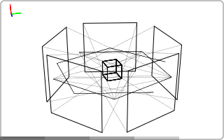
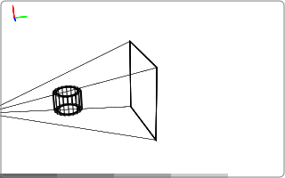

.. _topics_geometric_transforms:

====================
Geometric transforms
====================

.. image:: ../img/topics_transforms_translate.svg
   :width: 20%
.. image:: ../img/topics_transforms_rotate.svg
   :width: 20%
.. image:: ../img/topics_transforms_scale.svg
   :width: 20%
.. image:: ../img/topics_transforms_reflect.svg
   :width: 20%

The geometries introduced in the previous chapter can be moved and manipulated
using geometric transforms. The transforms can perform actions such as
translation and rotation. In this topic guide, we introduce the various
transforms available in tomosipo and show how to use them.

.. contents:: Overview
   :depth: 2

Using transforms
================

The transform creation functions, such as :py:meth:`ts.translate <tomosipo.geometry.transform.translate>`, do not perform an
actual geometric transformation. Rather, they return an object that can be used
to perform actual geometric transformations. In addition, the transform objects
can be composed to create more complex motions. This design makes it possible to
build complex systems from simple foundations. In this section, we explain how
this works in practice.

Creating a transform
--------------------

A :py:class:`~tomosipo.geometry.transform.Transform` represents a geometric
transformation by a 4-by-4 matrix using `homogeneous coordinates
<https://hackernoon.com/programmers-guide-to-homogeneous-coordinates-73cbfd2bcc65>`_.
These matrices are commonly used in graphics programming and can represent
translation, rotation, scaling, reflection, and a host of other transformations.
The code below shows an example of such a matrix used for translation.

.. doctest:: usage

    >>> import tomosipo as ts
    >>> T = ts.translate((1, 2, 3))
    >>> T
    Transform(
        [[[1. 0. 0. 1.]
      [0. 1. 0. 2.]
      [0. 0. 1. 3.]
      [0. 0. 0. 1.]]]
    )

Move an object
--------------

You can use the transformation to move an object as follows:

.. doctest:: usage

    >>> vg = ts.volume(shape=1)
    >>> T * vg
    ts.volume(
        shape=(1, 1, 1),
        pos=(1.0, 2.0, 3.0),
        size=(1.0, 1.0, 1.0),
    )

As you can see, the volume has moved from its original position on the origin to
position `(1, 2, 3)`. You can move any geometry in tomosipo by multiplying with
a :py:class:`~tomosipo.geometry.transform.Transform`.

Composing transforms
--------------------

In addition to moving geometries, you can multiply transforms with each other to
obtain a composed transform. In the code below, we create a translation to move
the object back to the origin.

.. doctest:: usage

   >>> T2 = ts.translate((-1, -2, -3))
   >>> T2 * T
   Transform(
       [[[1. 0. 0. 0.]
     [0. 1. 0. 0.]
     [0. 0. 1. 0.]
     [0. 0. 0. 1.]]]
   )

.. doctest:: usage

   >>> T2 * T * vg
   ts.volume(
       shape=(1, 1, 1),
       pos=(0.0, 0.0, 0.0),
       size=(1.0, 1.0, 1.0),
   )

As you can see, the composed transform `T2 * T` is represented by the identity
matrix. Also, the volume is moved back to the origin.

Inverting transforms
--------------------

In general, any transform can be undone by multiplying with its inverse:

.. doctest:: usage

   >>> T * T.inv
   Transform(
       [[[1. 0. 0. 0.]
     [0. 1. 0. 0.]
     [0. 0. 1. 0.]
     [0. 0. 0. 1.]]]
   )

Movement over time
------------------

So far, we have used a single transformation. In practice, you probably want to
apply multiple transformations over time. This is possible in tomosipo:

.. doctest:: usage

   >>> T = ts.translate((1, 0, 0), alpha=[0.0, 1.0, 2.0])
   >>> T.num_steps
   3
   >>> T * vg.to_vec()
   ts.volume_vec(
       shape=(1, 1, 1),
       pos=array([[0., 0., 0.],
          [1., 0., 0.],
          [2., 0., 0.]]),
       w=array([[1., 0., 0.],
          [1., 0., 0.],
          [1., 0., 0.]]),
       v=array([[0., 1., 0.],
          [0., 1., 0.],
          [0., 1., 0.]]),
       u=array([[0., 0., 1.],
          [0., 0., 1.],
          [0., 0., 1.]]),
   )

As you can see, the transformed volume now moves up starting at `(0, 0, 0)` and
ending at `(2, 0, 0)`. This was achieved by multipling the axis of translation
by the three values of `alpha`. The number of time steps in a transform is
accessible using the `num_steps` attribute.

.. note::

   In the code sample, you can see that we have converted `vg` to a vector
   geometry before multiplying with `T`. A normal volume geometry cannot move
   over time, and a vector volume geometry can. Thus the output must necessarily
   be a volume vector geometry. If we had not explicitly converted to a vector
   geometry, tomosipo would have performed the conversion implicitly, while
   issuing a warning that the conversion had taken place behind the scenes. In
   general, it is advised to perform these conversions explicitly to aid readers
   of your code.

Composing multiple transforms over time
---------------------------------------

Any transform can multiplied by a single-time-step transform. Multiplying two
multi-time-step transforms requires that their number of steps is equal. This
mirrors the broadcasting rules for numpy arrays.

.. doctest:: usage

   >>> T1 = ts.translate((1, 0, 0))
   >>> T2 = ts.translate((1, 0, 0), alpha=[0.0, 1.0])
   >>> T3 = ts.translate((1, 0, 0), alpha=[0.0, 1.0, 2.0])
   >>> (T1 * T2).num_steps
   2
   >>> (T1 * T3).num_steps
   3
   >>> (T3 * T3).num_steps
   3
   >>> (T2 * T3).num_steps  # Not allowed
   Traceback (most recent call last):
   ...
   ValueError: Cannot multiply transforms with different number of time steps. Got steps: 2 and 3

Overview of transforms
======================

Tomosipo provides six convenience functions to create commonly used transforms.
We discuss them here.

Translate
---------
.. image:: ../img/topics_transforms_translate.svg
   :width: 20%

As discussed above, the :py:meth:`ts.translate
<tomosipo.geometry.transform.translate>` function creates a translation
transform. The animation you see is generated by the code below.

.. testcode:: translate

   import tomosipo as ts
   import numpy as np
   vg = ts.volume(size=1.0).to_vec()

   t = np.linspace(0, 1, 5)
   T = ts.translate(axis=(0, 1, 0), alpha=t)
   ts.svg(T * vg).save("./doc/img/topics_transforms_translate.svg")

Rotate
------
.. image:: ../img/topics_transforms_rotate.svg
   :width: 20%

The :py:meth:`ts.rotate <tomosipo.geometry.transform.rotate>` function creates a
rotation transform. The animation you see is generated by the code below.

.. testcode:: rotate

   import tomosipo as ts
   import numpy as np
   vg = ts.volume(size=1.0).to_vec()

   t = np.linspace(0, 1, 5)

   R = ts.rotate(pos=0, axis=(1, 0, 0), angles=np.pi * t)
   ts.svg(R * vg).save("./doc/img/topics_transforms_rotate.svg")

Scale
-----

The :py:meth:`ts.scale <tomosipo.geometry.transform.scale>` function creates a
scaling transform. The animation you see is generated by the code below.

.. testcode:: scale

   import tomosipo as ts
   import numpy as np
   vg = ts.volume(size=1.0).to_vec()

   t = np.linspace(0, 1, 5)

   S = ts.scale((1, 1, 1), alpha=1 + t)
   ts.svg(S * vg).save("./doc/img/topics_transforms_scale.svg")

Reflect
-------

The :py:meth:`ts.reflect <tomosipo.geometry.transform.reflect>` function creates a
reflection transform. The animation you see is generated by the code below.

.. testcode:: reflect

   import tomosipo as ts
   import numpy as np
   vg = ts.volume(size=1.0).to_vec()

   t = np.linspace(0, 1, 5)

   mirror = ts.volume(pos=(0, 2, 0), size=(2, 0, 2))
   M = ts.reflect(pos=mirror.pos, axis=(0, 1, 0))
   ts.svg(
     vg,
     M * vg,
     mirror,
   ).save("./doc/img/topics_transforms_reflect.svg")

To / from perspective
---------------------

The functions
:py:meth:`ts.to_perspective <tomosipo.geometry.transform.to_perspective>` and
:py:meth:`ts.from_perspective <tomosipo.geometry.transform.from_perspective>` create perspective transforms. The animation you see are generated by the code below.

.. testcode:: perspective

   import tomosipo as ts
   import numpy as np
   vg = ts.volume(size=0.5).to_vec()
   pg = ts.cone(angles=5, size=2, src_orig_dist=2, src_det_dist=4).to_vec()

   ts.svg(vg, pg).save("./doc/img/topics_transforms_perspective1.svg")

   P = ts.from_perspective(vol=pg.to_vol())

   ts.svg(P * vg, P * pg).save("./doc/img/topics_transforms_perspective2.svg")
