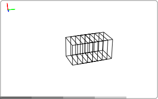
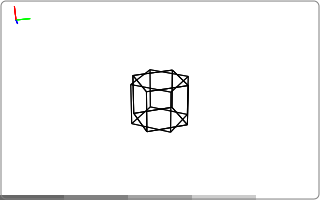
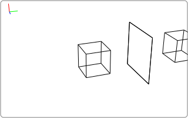

====================
Geometric transforms
====================

The geometries introduced in the previous chapter can be moved and manipulated
using geometric transforms. The transforms can perform actions such as
translation and rotation. In this topic guide, we introduce the various
transforms available in tomosipo and show how to use them.

Overview of transforms
======================

Tomosipo provides six convenience functions to create commonly used transforms.
These are listed below.

.. autosummary::

   tomosipo.translate
   tomosipo.rotate
   tomosipo.scale
   tomosipo.reflect
   tomosipo.to_perspective
   tomosipo.from_perspective

.. testcode:: overview

   import tomosipo as ts
   import numpy as np
   vg = ts.volume(size=1.0).to_vec()

   t = np.linspace(0, 1, 5)
   T = ts.translate(axis=(0, 1, 0), alpha=t)
   ts.svg(T * vg).save("./doc/img/topics_transforms_translate.svg")

   R = ts.rotate(pos=0, axis=(1, 0, 0), angles=np.pi * t)
   ts.svg(R * vg).save("./doc/img/topics_transforms_rotate.svg")

   S = ts.scale(np.tile(1 + t[:, None], (1, 3)))
   ts.svg(S * vg).save("./doc/img/topics_transforms_scale.svg")

   mirror = ts.volume(pos=(0, 2, 0), size=(2, 0, 2))
   M = ts.reflect(pos=mirror.pos, axis=(0, 1, 0))
   ts.svg(
     vg,
     M * vg,
     mirror,
   ).save("./doc/img/topics_transforms_reflect.svg")

